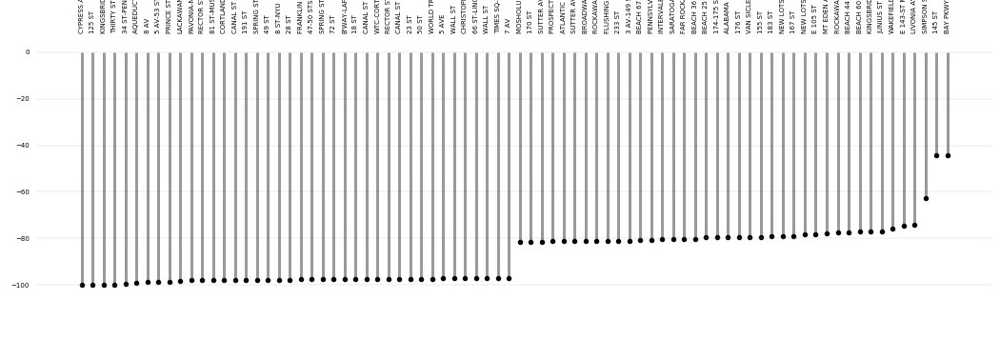

# MTA_TurnstileAnalysis
Scrape and clean MTA subway data, compare 04/2019 with 04/2020 (during stay at home). 
Tools: Python, Pandas, Seaborn

The aim is to find the subway stations, the overall traffic has changed the least. 

Combining data from:
* http://web.mta.info/developers/turnstile.html
* https://data.cityofnewyork.us/Transportation/Subway-Stations/arq3-7z49

Least and Most Effected Stations:

The final data is exported to a csv, final mapping is done in QGIS

